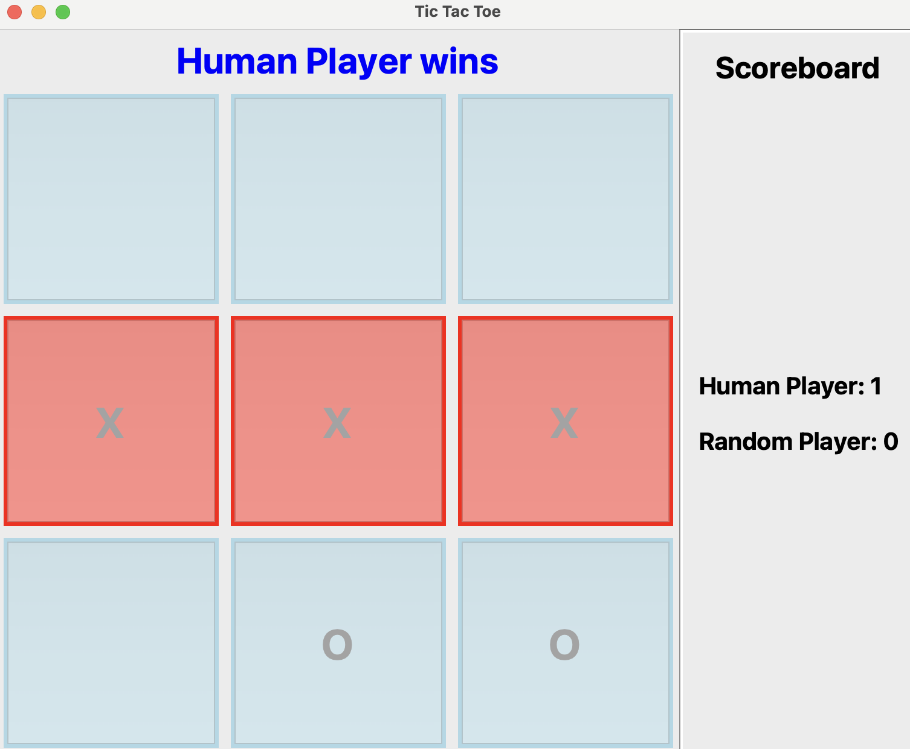

# Tic Tac Toe
In this project, you will have the chance to implement various AI algorithms that can play a classical game of Tic Tac Toe.

<p align="center">
  
</p>

## Set up Environment
To set up the environment for this project, follow these steps: 
1. Install and setup [conda](https://docs.anaconda.com/free/miniconda/#quick-command-line-install).
2. Create environment.
```
conda create --name tictactoe python=3.8.19
conda activate tictactoe
pip install -r requirements.txt
```
## Project Structure
* [game.py](project/game.py) contains the game logic. **You should read this file to implement your agent.**
* [gameplay.py](project/gameplay.py) contains game interactions between players (both AI and Human). **You don't need to read this file.**
* [player.py](project/player.py) contains an abstract class from which you will inherit to implement your own agents.
* [tictactoe](project/tictactoe) folder contains AI agents for the game.

## Command-Line Usage

1. Quickstart
```
python main.py
```
2. Options
```
python main.py -p1 [PLAYER_1] -p2 [PLAYER_2] -m [VISUALIZATION] -n [NUM_GAMES] -t [TIMEOUT]
```
+ `--player1` or `-p1` : Choose player 1.
+ `--player1` or `-p1` : Choose player 2.
    + Choices of player: 'minimax', 'alphabeta', 'mcts', 'qlearning', 'human', 'random'.
+ `--mode` or `-m` : Choose visualization mode ('silent', 'plain', or 'ui'). 
    + 'silent' only shows game result (not possible for human player). 
    + 'plain' shows the game state in terminal. 
    + 'ui' shows the game with integrated UI.

+ `--num_games` or `-n` : Number of games for evaluations. Not that players will be assigned 'X' and 'O' alternately between games.
+ `--timeout` or `-t` : Set timeout for each AI move. No timeout is set for Human move. Default is 10 seconds per move.
+ `--no_timeout` or `-nt` :  No timeout for AI move.


## TODO
You will implement 4 AI agents for the game: Minimax, Minimax with Alpha-Beta Pruning, Q-Learning, Monte Carlo Tree Search. The templates for each algorithm are given inside [tictactoe](project/tictactoe). You are recommended to follow the templates. However, you have the freedom to code in your way.

**Note 1:** If you implement the algorithms correctly, your AI agents should outperform Random Player and have relatively similar performance when played against each other.

**Note 2:** You should start early as the code is not easy. Most important of all, have fun coding ^_^
