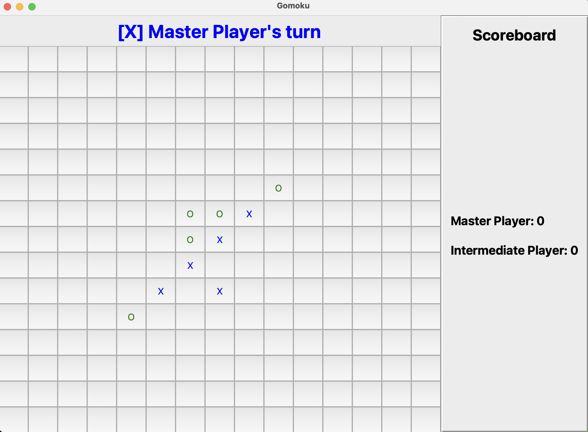

# Gomoku
In this project, you will implement various AI algorithms for Gomoku, an extension of Tic Tac Toe.

<p align="center">
  
</p>

## Set up Environment
To set up the environment for this project, follow these steps: 
1. Install and setup [conda](https://docs.anaconda.com/free/miniconda/#quick-command-line-install).
2. Create environment.
```
conda create --name tictactoe python=3.8.19
conda activate tictactoe
pip install -r requirements.txt
```
## Project Structure
* [game.py](project/game.py) contains the game logic. **You should read this file to implement your agent.**
* [gameplay.py](project/gameplay.py) contains game interactions between players (both AI and Human). 
* [player.py](project/player.py) contains an abstract class from which you will inherit to implement your own agents.
* [gomoku](project/gomoku) folder contains AI agents that you need to implement.
* [bots](project/gomoku/bots) folder contains Gomoku bots that you can use to evaluate your agents.

## Command-Line Usage

1. Example usage
```
python main.py -p1 master -p2 intermediate -n 4 -m ui
```
2. Options
```
python main.py -p1 [PLAYER_1] -p2 [PLAYER_2] -m [VISUALIZATION] -n [NUM_GAMES] -t [TIMEOUT] -s [SIZE]
```
+ `--game` or `-g` : Choose Tic Tac Toe or Gomoku (default='gomoku').
+ `--player1` or `-p1` : Choose player 1.
+ `--player1` or `-p1` : Choose player 2.
    + Choices of player: 'minimax', 'alphabeta', 'mcts', 'qlearning', 'human', 'random'.
+ `--mode` or `-m` : Choose visualization mode ('silent', 'plain', or 'ui'). 
    + 'silent' only shows game result (not possible for human player). 
    + 'plain' shows the game state in terminal. 
    + 'ui' shows the game with integrated UI.

+ `--num_games` or `-n` : Number of games for evaluations. Not that players will be assigned 'X' and 'O' alternately between games.
+ `--timeout` or `-t` : Set timeout for each AI move. No timeout is set for Human move. Default is 10 seconds per move.
+ `--no_timeout` or `-nt` :  No timeout for AI move.
+ `--size` or `-s` : Size of the board for Gomoku (default=15).
+ `--load` or `-l` : Load the Q table for Tabular Q-Learning agent, for weights for the features in Approximate Q-Learning agent. You should give only the file name of the weight to this argument.
+ `--no_train` : No training for Q-Learning agents.

3. Evaluation
```
python evaluation.py -p [PLAYER] 
```
to evaluate AI agent with our hand-crafted [test cases](project/evaluation.py). The output of evaluation is given in [evaluation](evaluation) folder.
+ `--load` or `-l` : Load the Q table for Tabular Q-Learning agent, for weights for the features in Approximate Q-Learning agent. You should give only the file name of the weight to this argument.
+ `--no_train` : No training for Q-Learning agents.

## TODO
You will implement 5 AI agents for the game: [Reflex Agent](project/gomoku/reflex.py), [Minimax with Alpha-Beta Pruning](project/gomoku/alphabeta.py), [Q-Learning](project/gomoku/q_learning.py), [Standrad Monte Carlo Tree Search](project/gomoku/mcts_v1.py), [Better Monte Carlo Tree Search](project/gomoku/mcts_v2.py). You are recommended to follow the templates. However, you have the freedom to code in your way.

## Implementation Note
* If you want to create a new agent, add the agent to [`project/gomoku/__init__.py`](project/gomoku/__init__.py) and then initialize the agent in [`project/__init__.py`](project/__init__.py)
* If your agent has memory between moves in a game (e.g, a winning sequence or move history), you may need to implement `restart()` function for your agent to restart after each game to avoid bugs during game evaluation. Refer to [`master.py`](project/gomoku/bots/master.py) as an example. However, note that for QLearning agent, the trained weight or Q table should not be reset.
* For Q-Learning agents, the Q-table (for Tabular Q-Learning) or the training weights (for Approximate Q-Learning) are automatically saved after training to q_table or q_weights folder respectively. The weight file has the format `{NxN}_{NUM_SIMULATIONS}.pkl` with N as the size of the board used for training. To load the training weight (both for games between agents and evaluations with test cases), please use the `--load` or `-l` command with the weight file.